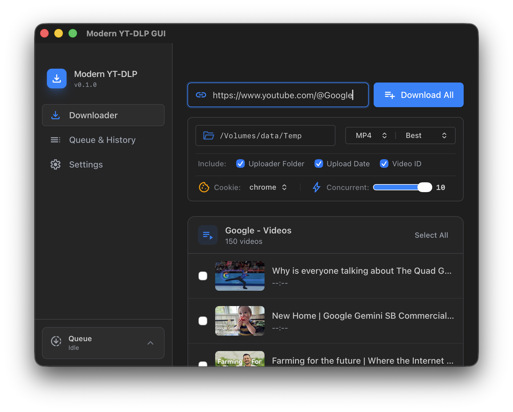

# yt-dlp Modern GUI


一个现代化、跨平台的桌面应用，用于使用 yt-dlp 下载视频。
基于 Tauri 2.0 (Rust) 和 SvelteKit 构建，为视频下载管理提供了简洁直观的界面。

[**English**](../README.md) | [**한국어**](README.ko.md) | [**日本語**](README.ja.md) | **中文(简体)** | [**中文(繁體)**](README.zh-TW.md) | [**Español**](README.es.md) | [**Français**](README.fr.md) | [**Deutsch**](README.de.md) | [**Português**](README.pt-BR.md) | [**Русский**](README.ru.md) | [**Tiếng Việt**](README.vi.md)

## 截图

<p align="center">
  
</p>
<p align="center">
  
</p>

## 功能特性

- 支持格式和画质选择的视频和播放列表下载
- 支持取消和重试的并发下载队列
- 带有搜索和管理功能的下载历史记录
- 自动 yt-dlp 和 FFmpeg 依赖检测及安装指南
- 文件名模板自定义（简洁和高级模式）
- 认证内容的 Cookie 支持
- 重复下载检测
- 多语言支持（English、한국어、日本語、简体中文、繁體中文、Français、Deutsch）
- 4种颜色主题（Dark、Violet、Red、Light）
- 跨平台支持（Windows、macOS、Linux）

## 从源码构建

### 前置条件

- [Rust](https://www.rust-lang.org/tools/install)（最新 stable 版本）
- [Node.js](https://nodejs.org/)（v18+）
- [Bun](https://bun.sh/)（包管理器）
- [Tauri 2.0](https://v2.tauri.app/start/prerequisites/) 平台相关依赖

### 构建步骤

```bash
# 克隆仓库
git clone https://github.com/shlifedev/yt-dlp-modern-gui.git
cd yt-dlp-modern-gui

# 安装前端依赖
bun install

# 以开发模式运行
bun run tauri dev

# 生产环境构建
bun run tauri build
```

生产环境构建输出位于 `src-tauri/target/release/bundle/`。

## 路线图

1. 面向移动用户的下载器应用（可以自行托管 yt-dlp 服务器）
2. 版本更新器

## 许可证

该项目在 [MIT License](../LICENSE) 下获得许可。
